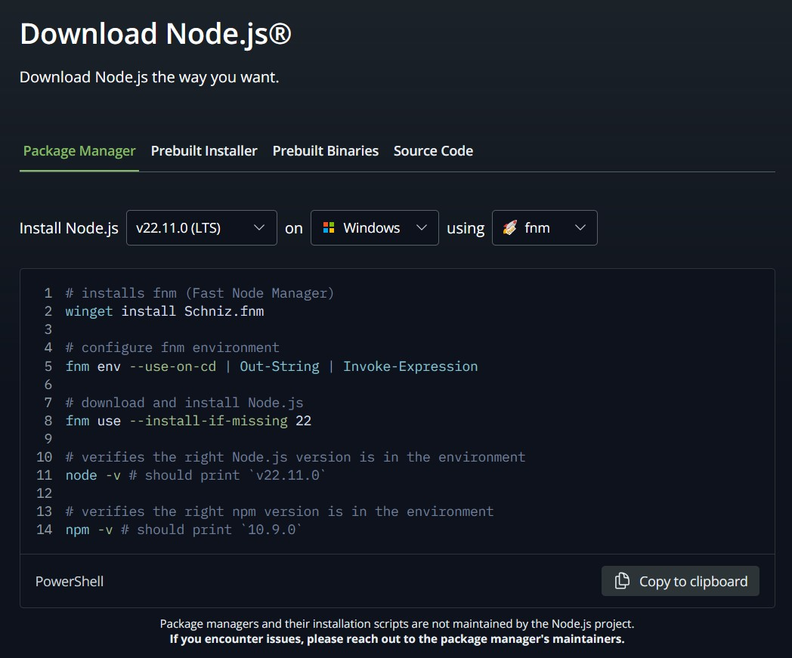

# REST-API-project

REST API project using Django and React for learning purposes. It has been developed following this [tutorial](https://www.youtube.com/watch?v=38XWpyEK8IY&t=527s). Below I explain some of the steps followed, as a way to internalize what has been learned and as notes that will be useful in case I want to carry out a new similar project.

I carried an alike project that can be found [here](https://github.com/Jooxbac/Django-REST-Framework-API-Project). As it describes thoroughly how it was developed and this one shares some features, this README.md will be oriented mainly to the differences.


[!DANGER]
> README.md under development! the following info was copied and pasted here from my another project as a way to take advantage of the contents and structure already written.
 
## Setup Steps


Same as the other project, but:

`pip install django-cors-headers`, añade headers. Para que no surjan problemas con el servidor que tendremos en el puerto 8000 y otro que creemos (será con Vite, en el puerto 5173, lo veremos más adelante).
Add 'corsheaders' to `INSTALLED_APPS` in project's `settings.py` and also to `MIDDLEWARE` in the same file, as high as possible and at least before "django.middleware.common.CommonMiddleware" as recommended at [django-cors-headers docs](https://pypi.org/project/django-cors-headers/).
Then add `CORS_ALLOWED_ORIGINS`in settings.py, that holds a list of origins authorized to make cross-site HTTP request, empty by now. Again, [check the docs](https://pypi.org/project/django-cors-headers/) for any doubt.

For using React:

Install node  en Powershell, como administrador, para que el segundo comando no de problemas. Además, debemos permitir la ejecución de scripts, (vemos el valor actual con `Get-ExecutionPolicy`) introduciendo en PowerShell `Set-ExecutionPolicy RemoteSigned` y respondiendo que si a lo que pida. Cerramos y abrimos porwershell como admin y entonces introducimos los pasos de la imagen. Sin embargo desde cmd no podía acceder a `node -v` o `npm -v`, hay que añadir node a las variables del entorno, en Path. Desde la powershell usamos `(Get-Command node).Source` para obtener el directorio donde está node, y lo añadimos a las variables del entorno, no el ejecutable, sino la carpeta que lo contiene, ojo (Clic derecho en este equipo > Propiedades > Configuración avanzada del sistema > Variables de entorno... > Seleccionar variable del sistema Path, añadir nuevo y meter la ruta de node).
Comprobar después en cmd que podemos acceder a node y npm con `node -v` y `npm -v`. Recordar recuperar la política de Powershell con respecto a los scripts con `Set-ExecutionPolicy [valor_anterior]]`. En mi caso era "Restricted". Podemos comprobar el valor actual con `Get-ExecutionPolicy`


# Backend:

## Models:

Create a model in app's models.py file.

Enter migrations commands.

py manage.py createsuperuser for creating users we can enter into `http://127.0.0.1:8000/admin`.

There are no Tasks in this admin panel. If we want to show them, we have to register the model in admin.py into the app's folder. We import our model and then register it with `admin.site.register([model_name])`.

Now we can add Tasks, but what's showing is just an "[model_name] object". To edit what is showed, we can create a __str__ function inside the model, that returns what we want to be showed.

## Queryset , API

Create serializers.py in app's folder.

Create View.

Add urls to app and then to project.


## Auto Docs using Coreapi module

Añadir módulo para que autodocumente nuestra app.

`pip install coreapi`

Add module to INSTALLED_APPS, go to urls in app and add route to docs.

Requiere versión de Python 3.10 o anterior, por lo que tendremos que crear el entorno virtual usando esa versión, si ya lo hemos creado con una versión más actual, entonces tendremos que volver a empezar, pues no se permite el cambio de versión del entorno, usa aquella con la que fue creado.

# Frontend:

## Configuración de React

Dejamos el servidor abierto en la terminal de python y abrimos una nueva terminal (cmd).

Usaremos la herramienta Vitejs

npm create vite (Aceptamos instalar el paquete)

Damos un nombre al proyecto (hemos escogido "client"), seleccionamos el framework a usar (React en este caso), y la variante (JS en este caso)

Introducimos los comandos facilitados en la consola:

"""console
  cd [nombre proyecto]
  npm install
  npm run dev
"""

Entramos en `http://localhost:5173/`


Comunicar frontend con Backend:

Salimos del modo dev de vite en la consola, y en la consola, dentro de cliente, instalamos unos módulos:

npm i react-router-dom react-hot-toast axios react-hook-form

(Nota: npm i = npm install)

react-router-dom es un módulo para poder tener múltiples páginas en el frontend, react-hot-toast permite tener unos mensajes cuando realizemos alguna acción (como notificaciones), axios módulo para peticiones, react-hook-form para validar input en el frontend

En proyecto de vite, src, en App.jsx tenemos la plantilla de lo que vemos en el cliente. Lo quitamos y ponemos un componente de React (con la abreviatura rfce, que tendremos un snippet asociado si descargamos la extensión para VSC ES7+ React/Redux/React-Native snippets). También eliminamos los estilos de App.css e index.css


Creamos rutas:

Creamos carpetas pages, components y api en src de client. Creamos unas páginas y añadimos las rutas en App.jsx, creamos un componente Navigation en el que vamos a poner enlaces a esas rutas y lo añadimos en App.jsx.


Pedir tasks al backend:

Creamos un componente TasksList y un fichero tasks.api.js en la carpeta api del proyecto de vite. El fichero en api realiza la llamada a la API y devuelve los datos, la función que hace eso será importada y llamada en el componenete TasksList. 

Nos dará un error en consola que dirá que no tenemos autorización (por esto instalamos el modulo django-cors-headers). Tenemos que ir a los settings del proyecto django y añadir la dirección a CORS_ALLOWED_ORIGINS.

Editamos TaskList.jsx para que los datos se muestren de modo correcto, y creamos un nuevo componente para los datos que se van a mostrar de la api.

Crear tareas:

Vamos a modificar la página del formulario, y nos ayudará el módulo react-hook-form.

Delete tasks:

...

Añadir estilos con tailwind y react-hot-toast

Uso de Toaster

Uso de Tailwind, lo instalamos siguiendo la [documentación oficial](https://tailwindcss.com/docs/guides/vite) para Vite en nuestro caso.


1. ### Creation of Virtual Environment

Enter the following commands on a console placed in your project folder (using the console offered by VSC directly): 

```console
pip install virtualenv
py -m virtualenv venv
```


2. ### Using the Virtual Environment

One option is to enter the following command:

```console
.\venv\Scripts\activate
```

For convenience, best option is to select the specific Python interpreter for out virtual environment. We can select it, on VSC, pressing "F1" and searching for "Python select interpreter". The adequate Python interpreter should be higlighted as the recommended one.


3. ### Installing Django and Django REST Frameworks

Enter the following commands:

```console
pip install django
pip install djangorestframework
```


4. ### Start Django Project

Enter this command:

```console
django-admin startproject [project-name] .
```

> [!NOTE]
> Notice the use of ".". If we are working in a folder already, that avoids the need to create an extra folder.


5. ### Start and Add App to settings.py

Enter this command:

```console
py manage.py startapp [app-name]
```

Then, go to `settings.py` inside the folder of our django project and add the name of the created app to the list of `INSTALLED_APPS`.


6. ### Add REST Framework Module to settings.py

Just like in the previous step: go to `settings.py` inside the folder of our django project and add `rest_framework` to the list of `INSTALLED_APPS`.


7. ### Running the Project Into a Local Server

We can use the following command to run our project in a local server whenever we want:

```console
py manage.py runserver
```

Sepecifications about the IP adress and port will be displayed after entering the command.